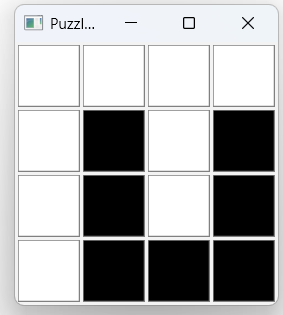

# 🧩 Yin-Yang Puzzle Validator

**A Qt-based application to validate and display all valid configurations of a 4×4 Yin-Yang puzzle.**

---

## 📜 Description

This application is a visual and computational tool for exploring the **Yin-Yang puzzle**, developed using **C++ and Qt**. It allows you to **generate**, **validate**, and **visualize** all valid configurations of a 4×4 Yin-Yang grid using both **DFS** and **BFS** approaches.

The puzzle enforces the following two rules:
1. **Connectivity Rule**: All black cells must be connected, and all white cells must be connected.
2. **No 2×2 Rule**: No 2×2 block may consist of cells with the same color.

---

## 🚀 Features

- ✅ Generates all valid puzzle configurations using **Depth-First Search (DFS)** or **Breadth-First Search (BFS)**.
- 🎨 Visualizes each configuration in a grid layout.
- ⚙️ Encodes puzzle states efficiently using bit manipulation.
- 🔎 Validates each configuration based on puzzle constraints.
- 📋 List of valid states with string representations.
- 🖱 Clickable entries to open a separate window showing the grid state.

---

## 🖼 Example

| Valid State Display | Description |
|---------------------|-------------|
|  | Each cell is either black (B), white (W), or empty (-). |

> Note: Add your own screenshot as `screenshot.png` in the root directory for display.

---

## 🧠 Technical Details

- **Programming Language**: C++
- **Framework**: Qt (Widgets)
- **Algorithmic Concepts**:
  - Bitmask encoding for cell colors and existence
  - Graph traversal: DFS & BFS
  - Grid-based connectivity validation
  - GUI: `QMainWindow`, `QGridLayout`, `QPushButton`, `QLabel`, etc.

---

## 🛠 How to Build & Run

### Prerequisites

- Qt 5 or 6 (e.g., Qt Creator or qmake/CMake)
- C++17 or later

### Steps

1. Clone the repository:
   ```bash
   git clone https://github.com/parsazamani1383/yin-yang-validator.git
   cd yin-yang-validator
